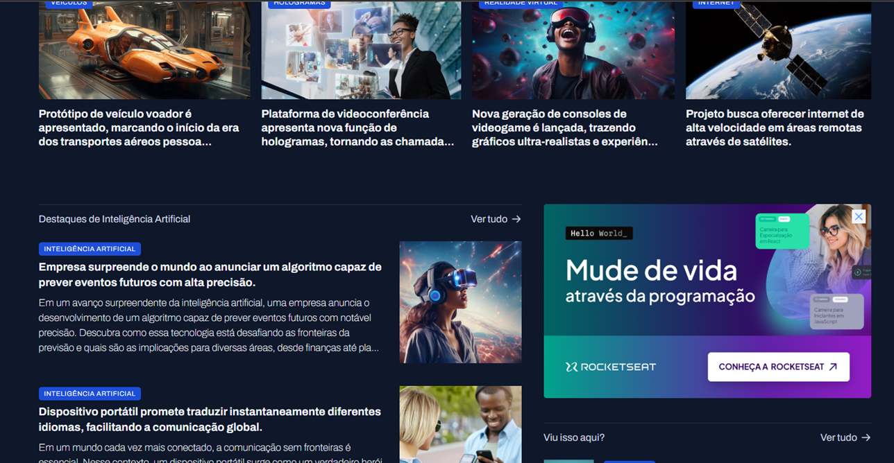

# Portal de notícias
Projetinho realizado após estudos de HTML CSS para [**Rocketseat🚀**](https://www.rocketseat.com.br/formacao/fullstack)

Projetinho simples de uma página de notícias sobre tecnologia e IA.  
Após os estudos resolvi me arriscar a criar por conta própria o projeto   
de acordo com o projeto do Figma, criado pela Rocketseat.

[**👉Portal de notícias - Github Pages👈**](https://oliveira-super.github.io/portal-de-noticias//)  

